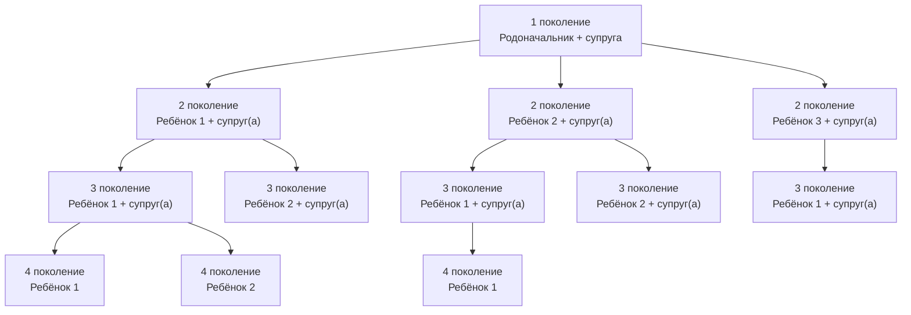

```mermaid
graph TD

    %% 1 ПОКОЛЕНИЕ
    G1["1 поколение<br/>Родоначальник + супруга"]

    %% 2 ПОКОЛЕНИЕ
    G2_1["2 поколение<br/>Ребёнок 1 + супруг(а)"]
    G2_2["2 поколение<br/>Ребёнок 2 + супруг(а)"]
    G2_3["2 поколение<br/>Ребёнок 3 + супруг(а)"]

    G1 --> G2_1
    G1 --> G2_2
    G1 --> G2_3

    %% 3 ПОКОЛЕНИЕ
    G3_1["3 поколение<br/>Ребёнок 1 + супруг(а)"]
    G3_2["3 поколение<br/>Ребёнок 2 + супруг(а)"]
    G3_3["3 поколение<br/>Ребёнок 1 + супруг(а)"]
    G3_4["3 поколение<br/>Ребёнок 2 + супруг(а)"]
    G3_5["3 поколение<br/>Ребёнок 1 + супруг(а)"]

    G2_1 --> G3_1
    G2_1 --> G3_2
    G2_2 --> G3_3
    G2_2 --> G3_4
    G2_3 --> G3_5

    %% 4 ПОКОЛЕНИЕ
    G4_1["4 поколение<br/>Ребёнок 1"]
    G4_2["4 поколение<br/>Ребёнок 2"]
    G4_3["4 поколение<br/>Ребёнок 1"]

    G3_1 --> G4_1
    G3_1 --> G4_2
    G3_3 --> G4_3

    %% ССЫЛКИ НА ЗАМЕТКИ OBSIDIAN
    %% Удалить или заменить адреса на свои
    click G2_1 "app://obsidian.md/Название%20ветки"
    click G3_1 "app://obsidian.md/Имя%20персоны"
```