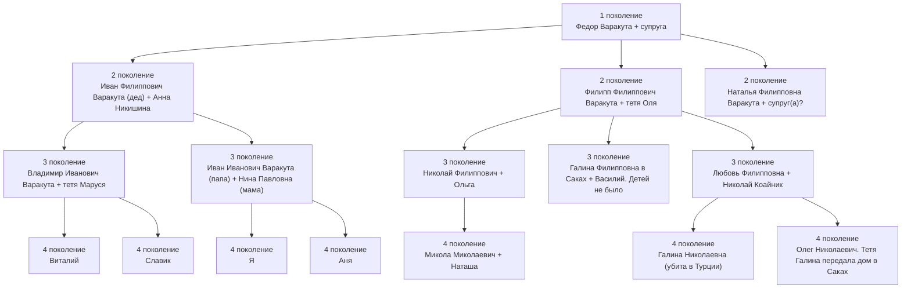

```mermaid
graph TD

    %% 1 ПОКОЛЕНИЕ
    G1["1 поколение<br/>Федор Варакута + супруга"]

    %% 2 ПОКОЛЕНИЕ
    G2_1["2 поколение<br/>Иван Филиппович Варакута (дед) + Анна Никишина"]
    G2_2["2 поколение<br/>Филипп Филиппович Варакута + тетя Оля"]
    G2_3["2 поколение<br/>Наталья Филипповна Варакута + супруг(а)?"]

    G1 --> G2_1
    G1 --> G2_2
    G1 --> G2_3

    %% 3 ПОКОЛЕНИЕ
    G3_1["3 поколение<br/>Владимир Иванович Варакута + тетя Маруся"]
    G3_2["3 поколение<br/>Иван Иванович Варакута (папа) + Нина Павловна (мама)"]
    G3_3["3 поколение<br/>Николай Филиппович + Ольга"]
    G3_4["3 поколение<br/>Галина Филипповна в Саках + Василий. Детей не было"]
    G3_5["3 поколение<br/>Любовь Филипповна + Николай Коайник"]

    G2_1 --> G3_1
    G2_1 --> G3_2
    G2_2 --> G3_3
    G2_2 --> G3_4
    G2_2 --> G3_5
 

    %% 4 ПОКОЛЕНИЕ
    G4_1["4 поколение<br/>Виталий"]
    G4_2["4 поколение<br/>Славик"]
    G4_3["4 поколение<br/>Я"]
    G4_4["4 поколение<br/>Аня"]
    G4_5["4 поколение<br/>Микола Миколаевич + Наташа"]
    G4_6["4 поколение<br/>Галина Николаевна (убита в Турции)"]
    G4_7["4 поколение<br/>Олег Николаевич. Тетя Галина передала дом в Саках"]

    G3_1 --> G4_1
    G3_1 --> G4_2
    G3_2 --> G4_3
    G3_2 --> G4_4
    G3_3 --> G4_5
    G3_5 --> G4_6
    G3_5 --> G4_7
    
    

    %% ССЫЛКИ НА ЗАМЕТКИ OBSIDIAN
    %% Удалить или заменить адреса на свои
    click G2_1 "app://obsidian.md/Название%20ветки"
    click G3_1 "app://obsidian.md/Имя%20персоны"
```
